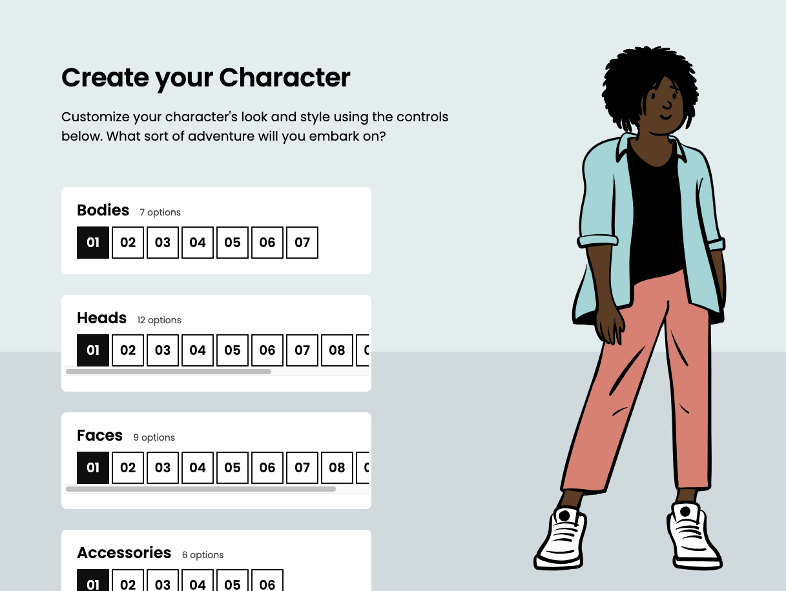

# CSS for JavaScript Developers Workshop 2: Character Creator - January 2024

Workshop related to Module 2: _Rendering Logic II_ of Josh Comeau's [CSS for JavaScript Developers](https://courses.joshwcomeau.com/css-for-js) course.

## Module 2 workshop: Character creator

A simple _React_ application with styles to improve, like :
- improve the global layout, with some fixed components
- handling of the overflow in other components
- adding a fixed skiline in the background, to obtain some depth

### Final rendering:

